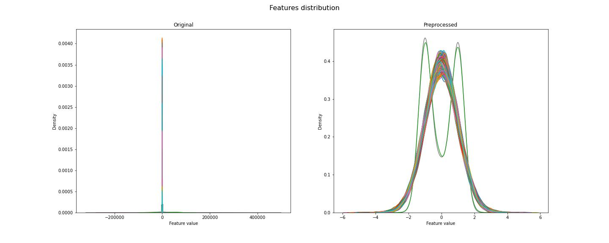
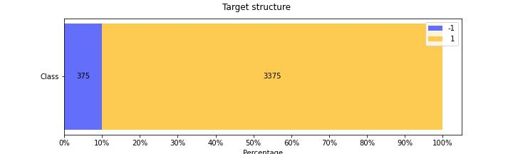
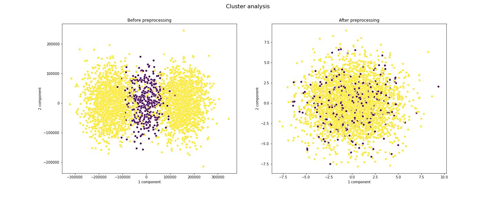
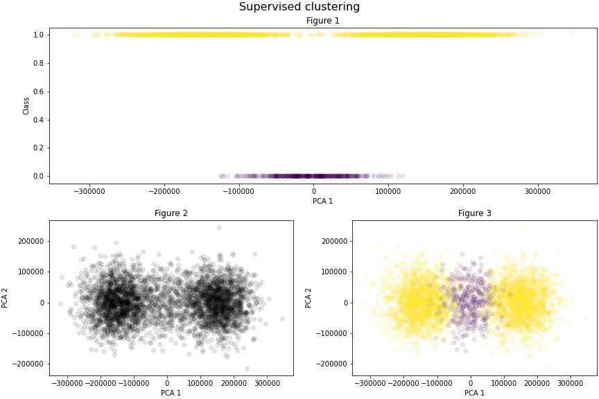
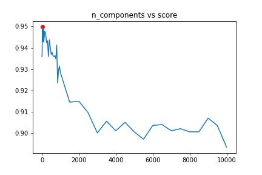

# Abstract

## Problem statement

The aim of this project was to investigate a number of models to find one with as high performance as possible. After a preliminary study of the provided data set, it became apparent that the problem fell under the imbalanced binary classification set with both classes being important. Thus, the study could be evaluated by two certain metrics: balanced accuracy score and weighted F1 score. Due to the class distribution, the major discovery was that not every classification model was suitable for this kind of problem.  

## Metrics

*The balanced accuracy* in a binary classification is a metric used to deal with imbalanced dataset. It is calculated as the average of the proportion of correctly predicted labels of each class individually.  

$Balanced$ $accuracy$ = $(Sensitivity + Specificity) \over 2$  

Where *sensitivity* is the true positive rate, true positive ratio to all positive predictions, and *specificity* is the true negative rate, true negative to all negative predictions respectively.  

*F1 score* is defined as the harmonic mean of *precision* and *recall*. Normally is used to evaluate model performance when the true class is important. In this case *weighted* parameter is apropriate due to the importance of both classes. The average calculated by this metric is weighted by the *support*, which is the number of samples with a given label.  

$F1 score$ = $2 * Precision * Recall \over Precision + Recall$  

Where *precision* is the ratio of true positives to all predicted positives, and *recall* is true positives to all positives ratio.  

# Analysis

## Data exploration

### Features

A collection of data intended for this project consists of training set with 3750 samples associated with a label from 2 classes and test set of 1250 samples. Each set has 10000 features, floating point type. Data set is complete and does not show any duplicates. Contamination by outliers is very low, less than 1% in the entire dataset, the highest indicator for columns reaches 2.8% and for rows 0.56%. Due to the low contamination, outliers do not need to be removed from the data.  

Most features present signs of Gaussian distribution, close to 95% passed the normal distribution test, what can be perfectly shown on the chart below after standardization.  

  

There are no significant correlations between features. Only one feature reaches positive correlation indicator above 0.7, the rest is neutral, oscilating below 0.1. There is no negative correlation at all.  

### Target

The target contains two classes: "-1" and "1" with 1:9 ratio, as shown in the chart below.  

  

Features to the target also do not show any relevant correlation, all results can be found between -0.07 and 0.07.  

# Techniques and methodology

## Baseline

Searching for the best model must be preceded by creating a baseline. For this purpose a `DummyClassifier` has been chosen. It is the simplest classificator that makes predictions absolutely ignoring the input features. It is working on one of five strategies:  

- *most_frequent* - always returns most frequent class label as a prediction,
- *prior* - similarly to *most_frequent*, always returns most frequent class label as a prediction, 
- *stratified* - returns the label, which got probability one in the one-hot vector of `predict_proba`,
- *uniform* - each class has equal probability, thus prediction is generated randomly,
- *constant* - constant label provided by the user is a prediction

## Data preprocessing

At the beginning the idea was to standardize the data by `StandardScaler` to bring the various numbers down to a common level and perform better scores. It standardizes each feature independently by removing the mean and scaling to the unit variance by following formula:  

$Z$ = $(x - u)\over s$  

Where $x$ is a sample, $u$ is the mean of the training samples and $s$ is the standard deviation.  

Removing outliers using *Interquartile range* (IQR) method was a subsequent step to minimize the risk of misjudged results. This is a measure of statistical dispersion, which is the spread of the data. To calculate the IQR, the data set is divided into quartiles:  

- Q1 - known as lower quartile, 25th percentile,
- Q2 - median, 50th percentile,
- Q3 - upper quartile, 75th percentile,
  
and then by removing lower quartile from the upper quartile:  

$IQR$ = $Q3 - Q1$  

In the end new data set is created through selecting samples, which fit the range between $(Q1 - 1.5*IQR)$ and $(Q3 + 1.5*IQR)$.  

The last step was reduction of dimensions based on ANOVA test, which is a statistical technique used to check if the means of two or more groups significanlty differ. After these steps it turned out that clusters are indistinguishable, as can be seen in the attached diagram.  

  

Thus, every previous step had to be reconsidered. For this purpose `KernelPCA` with 1 and 2 components was used. Second look without any preprocessing revealed ordered clusters. First diagram clearly shows that the labels overlap in a certain area, there is no significant gap in distribution of label "1" (yellow color). Second graph is more optimistic, two structured clusters are clearly visible, but the clouds belong to one class. After applying the colors, second cluster emerges between two strong appearances of the first class.  

  

Feature selection relied on retaining the data, which explained 95% of the variance. `PCA` with 0.95 components had been used to achieve this goal.  

It quickly became clear, that ordinary `PCA` is not the best way to reduce dimensions. Provided data set showed symptoms of non-linearity, thus `KernelPCA` was better option.

However, main problem here was component selection. `PCA` allows to set up 0.95 as a component, which means: "take the amount of components, that explain 95% of variance". Such a procedure is not possible with `KernelPCA`. The finest amount of components was emerged through trial and error, chart below presents results of that trial.

  

It turned out that 21 components is fine.

## Finding best model

### Dataset split

Splitting the data set is the most important part of the entire machine learning process. The more varied the training set the better the model performance. It also raises the chance of avoiding overfitting. Imbalanced classification requires every precaution to be taken. `RepeatedStratifiedKFold` had been used as a cross validation to `GridSearch` during the search for the best model. It seemed to be the best option for this challenge, for the sake of several functionalities it offers:  

- splitting entire data into $n$-assigned folds,
- maintaining a proper data balance,
- paying attention to data randomization,
- repetitiveness.  

However, for learning selected algorithm ordinary `train_test_split` had been used with keeping *shuffle* statement and *stratify* focused on target.

### Classifiers selection

The longest and hardest part of the entire project was the selection of algorithms, which would be able to catch regularities among this imbalanced set of data. After insightful analysis a few algorithms had been chosen: 

| Classifier | Parameter | Input |
| ---------- | -------- | ----- |
|`KNeighborsClassifier` | n_neighbors weights algorithm| `np.linspace(3, 21, 10)` *uniform*; *distance* *auto*; *kd-tree*; *brute* |
| `SVC` | C | `np.linspace(1, 10, 20)` |
| `MLPClassifier` | - | - |
| `DecisionTreeClassifier` | n_estimators criterion splitter max_features | 10; 100; 1000 *gini*; *entropy*; *log_loss* *best*; *random* *sqrt*; *log2*; *none* |
| `RandomForestClassifier` | n_estiamtors max_features| 10; 100; 1000 *auto*; *sqrt*; *log2*  |
| `ExtraTreeClassifier` | n_estimators criterion max_features | 10; 100; 1000 *gini*; *entropy*; *log_loss* *sqrt*; *log2*; *none*

For searching the best model, `GridSearchCV` had been used due to its exhaustive approach and cross validation support. 

It turned out that the best classifier for this data set is `KNeighborsClassifier` with following parameters:
- n_neighbors: 9,
- weights: *uniform*,
- algorithm: *auto*.  

# Summary

## Baseline vs learned model

To evaluate the model effectivenes it is necesary to compare its results to previously prepared baseline. The matrix below presents the results for the baseline, which was `DummyClassifier` with *most_frequent* strategy.

**Baseline**
1. Confusion matrix:  
   
                            0        1

                  0         0      113              
                  1         0     1012

2. Score:  
   *balanced_accuracy_score* = **0.5**

3. Classification report:  
   
                     precision    recall  f1-score   support

                  0       0.00      0.00      0.00       113
                  1       0.90      1.00      0.95      1012

           accuracy                           0.90      1125
          macro avg       0.45      0.50      0.47      1125
       weighted avg       0.81      0.90      0.85      1125

**Model**
1. Confusion matrix:  
      
                            0        1

                  0       110        3              
                  1       126      886

2. Score:  
   *balanced_accuracy_score* = **0.92**

3. Classification report:  
   
                     precision    recall  f1-score   support

                  0       0.48      0.97      0.64       113
                  1       1.00      0.88      0.94      1012

           accuracy                           0.89      1125
          macro avg       0.74      0.93      0.79      1125
       weighted avg       0.94      0.89      0.91      1125

## Conclusions

Through developing and bringing the project to the final stage, several conclusions emerged:

1. **preparing charts and other data visualization means is crutial to get better insight of data**. Without visualizations presented above it would be harder to notice that preprocessing used at first baldy affects the provided data. 
2. **every data set needs individual approach**. There is no unified process path for any machine learning project. 
3. **dimensionality reduction strategy stronlgy depends on linearity or non-linearity of data classification**. Provided data set showed symptoms of non-linearity, what is visible on cluster analysis chart. It required the use of `KernelPCA` instead of ordinary `PCA`. 
4. **it is not easy to get revelant results with imbalanced data set**. Metrics used to evaluate model had to be considered in terms of what is important for the result. 
